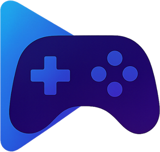
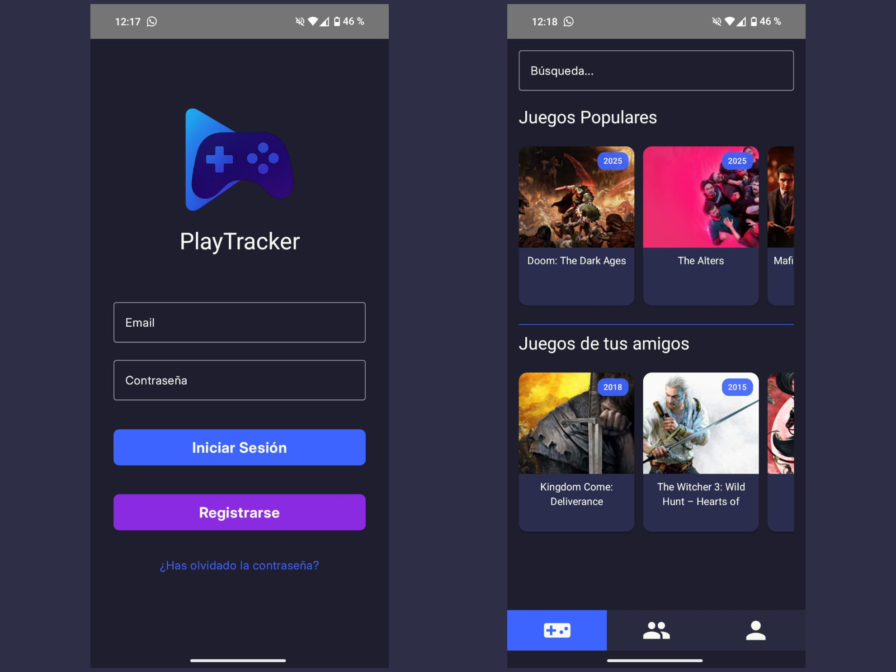
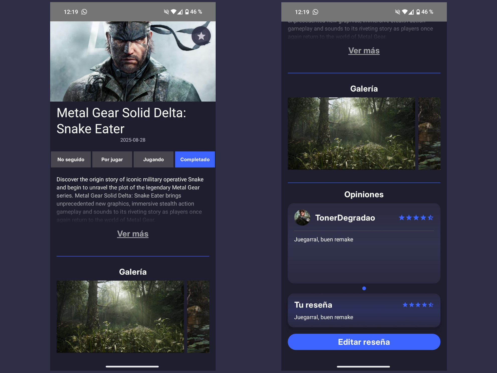
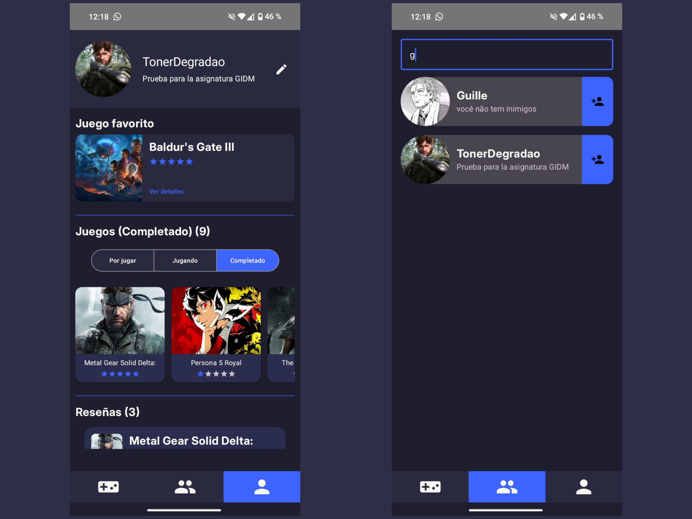

  
  PlayTracker

No podemos negar que la industria del videojuego en la actualidad, además de ser la que más dinero genera, es cada vez más popular. Jugar a videojuegos cada vez está menos estigmatizado, y desde hace ya unos años comenzamos a ver historias adultas con niveles de producción de las grandes películas de Hollywood, y otros que, aunque menos ambiciosos, podríamos considerar obras de arte.

La visión artística de los videojuegos, además de sus características técnicas y la gran variedad de géneros que existen, hacen que sean un campo muy susceptible a opiniones muy diversas. Sin embargo, no existe ninguna aplicación consolidada que permita hacer un seguimiento de los videojuegos que hemos jugado, compartir opiniones y contactar con otros jugadores con gustos similares.

Esto es lo que me llevó a desarrollar PlayTracker, una aplicación con la que podemos tener en el bolsillo todo nuestro recorrido por el mundo de los videojuegos, permitiéndonos:
- Obtener información de cualquier juego de cualquier plataforma, todo en el mismo lugar.
- Tener nuestra propia biblioteca de videojuegos, donde podemos cambiar el estado de los mismos (por jugar, jugando, completado).
- Crear y compartir valoraciones de los juegos, con un sistema de estrellas (de 1 a 5) y un texto tipo reseña.
- Obtener recomendaciones en base a los juegos de nuestra biblioteca y las valoraciones aportadas a cada uno.
- Conectar con otros usuarios para descubrir qué juegan, sus títulos favoritos y sus reseñas.

La aplicación ya está desarrollada y es completamente funcional, a excepción de que no dispongo de un entorno donde alojar el backend para que funcione correctamente, sin cortes y sin necesidad de tener un equipo propio funcionando siempre para ofrecer el servicio.

Es por ello que, aprovechando esta asignatura, voy a migrar la aplicación a la nube, añadiendo nuevas funcionalidades. Además, voy a refactorizar la mayor parte del código para simplificar los endpoints de la API, adaptarlo a los requisitos de un entorno en la nube, y seguir las buenas prácticas descritas en los guiones.`

A continuación muestro capturas de pantalla de la aplicación a día de hoy, para que se vean sus funcionalidades:

## Desarrollo de la asignatura
La documentación específica al desarrollo de los hitos de la asignatura está descrita en el documento de cada hito:
1. [Repositorio de pácticas y definición del proyecto](doc/hito1/README.md)
