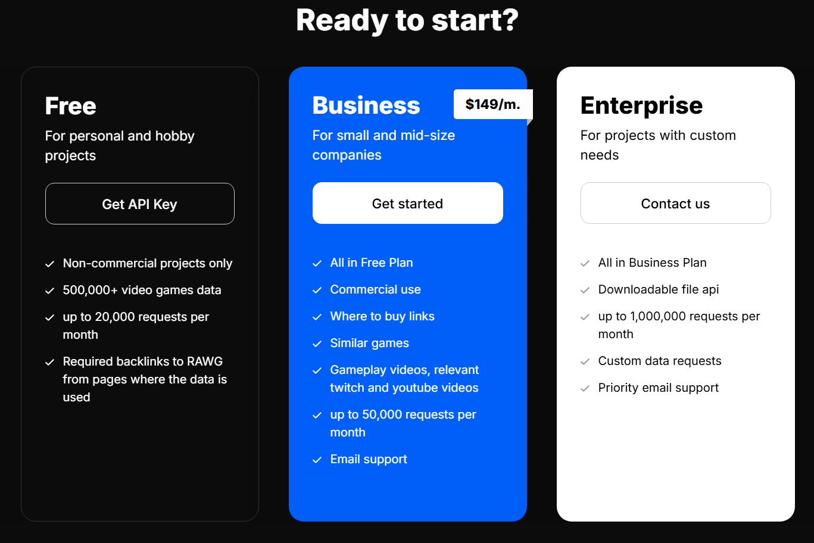
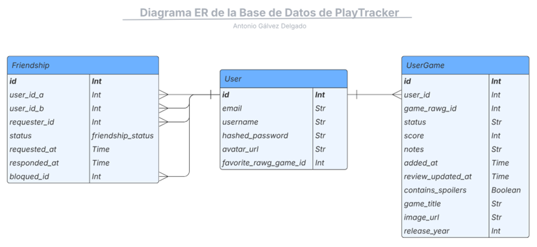
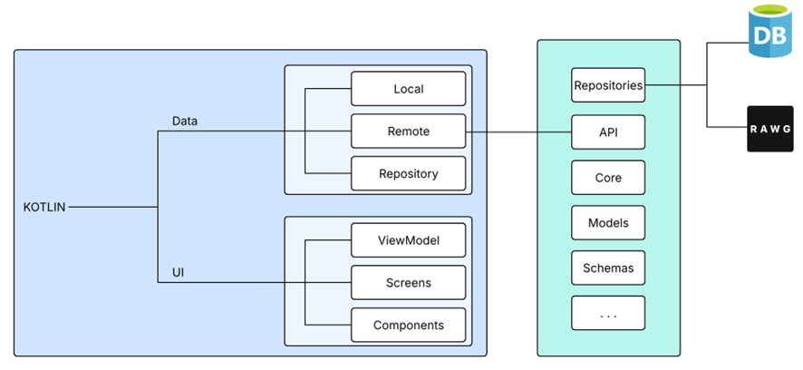

# Hito 1: Repositorio de pácticas y definición del proyecto
Como la aplicación ya está desarrollada y en GitHub, he hecho una nueva rama para la asignatura (no me deja hacer fork porque el proyecto es mío). En este documento describiré cómo está desarrollada la aplicación, los principales problemas que tiene ahora, y soluciones propuestas a dichos problemas que implementaré a lo largo de la asignatura. También incluyo un epígrafe con los beneficios de la migración de la aplicación a la nube. 

> <b>NOTA: Aunque este hito se centra en la creación y configuración del proyecto, al estar ya creado el proyecto y configurado el entorno y mi GitHub, me he centrado más en los problemas y soluciones propuestas, además de los beneficios de la migración a la nube. He creado nuevos Issues de los problemas descritos, y pueden verse todos los issues ya cerrados que creé en el desarrollo de la app.</b>

La descripción del proyecto ya está descrita en el [README de la raíz del proyecto](../../README.md), por lo que en este documento describiré exclusivamente lo descrito en el párrafo anterior.

## 1. Tecnologías utilizadas
- La aplicación está desarrollada en <b>Kotlin</b>, de forma nativa para Android.<br></br>

- Para la obtención de la información de los videojuegos, utilizo la API de la base de datos [RAWG](https://rawg.io/apidocs), utilizando el plan gratuito de la misma.<br></br>

- Para el desarrollo del backend, he utilizado <b>FastAPI</b> para crear la API.<br></br>

- La base de datos es PostgreSQL, utilizando SQLAlchemy en el backend para trabajar con ella y Alembic para la gestión de migraciones.

## 2. Problemas actuales
### Límite de llamadas a la API
Aunque la aplicación ya es funcional con las características mencionadas, existen problemas en cuanto a la viabilidad de un uso extendido de la aplicación. El principal problema es el límite del plan gratuito de la API de RAWG.



Como se comprueba en la imagen superior, el plan gratuito está limitado a 20.000 peticiones mensuales. Aunque puedan parecer muchas, hay que tener en cuenta que cada vez que se consulta la información de un juego se gasta una, y en el sistema de recomendación se gastan de 10 a 20 cada vez que se carga, dado que necesita buscar varios juegos en base a los gustos del usuario.

Para uso propio no hay problema, pero como mi idea a futuro es publicar la app, necesitaría una optimización del sistema de obtención de información. Expondré soluciones en el siguiente epígrafe.

### Seguridad
Durante el desarrollo, he dejado de lado la seguridad para centrarme en la funcionalidad de la aplicación. Aunque tengo mecanismos básicos y obligatorios como cifrado de constraseñas, uso de variables de entorno y protección de rutas, necesito asegurarme de la seguridad de forma más exhaustiva, en especial a la referente a las contraseñas y email de los usuarios.

## 3. Mejoras a realizar
Aprovechando la asignatura, además del proceso de migración a la nube requerido de manera obligatoria, voy a mejorar los siguientes aspectos de la app:
- Documentación correcta del código y la API.
- Refactorización de la API: tengo demasiados endpoints que no utilizo, y otros que simplemente podrían unificarse al ser muy parecidos.
- Minimización de las llamadas al backend y, sobre todo, a la API de RAWG. Esto es crítico debido al límite de peticiones mencionado.
<b>Posibles soluciones</b>
  - Scrapping para montar mi propia BD de videojuegos (muy complejo)
  - Caché de los juegos ya consultados en el backend, de manera que solo se piden de la API externa la primera vez.
- Tests automáticos.

## 4. Beneficios del despliegue en la nube
En esta aplicación veo claros beneficios del despliegue en la nube, que podrían simplificar los problemas que tengo con el despliegue:
1. <b>Mantenimiento y fiabilidad:</b> Actualmente no dispongo de ningún servidor donde pueda desplegar la aplicación de manera fiable y sin riesgo de caída del servicio. Un despliegue en la nube me despreocuparía de ese tipo de mantenimiento de hardware.
2. <b>Coste y escalabilidad:</b> Una de las características principales de la nube es la capacidad de aumentar y reducir recursos de manera automática en función de la demanda, y pagar únicamente por los recursos que se necesitan consumir en cada momento (pay as you go).
3. <b>Acceso global de usuarios:</b> Al ser una aplicación de carácter social, la interacción entre usuarios mejorará si el sistema está desplegado en la nube y distribuido entre varios servidores, disminuyendo la latencia asociada a la región geográfica desde la que se accede.
4. <b>Automatización y despliegues:</b> Como se describe en las prácticas de la asignatura, se podrá implementar un sistema de integración continua para actualizar el backend de manera automática y segura al añadir nuevas características o corregir errores, además de la posibilidad de hacer rollbacks de manera sencilla frente a problemas de versión.<br></br><br></br>

## Anexo: Documentación técnica adicional
En este epígrafe explicaré la estructura de la aplicación y de la base de datos de manera más profunda, incluyendo diagramas.

### Base de datos
La base de datos no es muy compleja, consta de tres entidades:
- User: información propia de los usuarios.
- Friendship: información de las relaciones de amistad entre usuarios y estado de las mismas (pending, accepted, rejected, blocked).
- UserGame: cada entrada relaciona un usuario con un videojuego (id del usuario con id del juego en RAWG). Además, contiene información básica de los juegos para no necesitar hacer llamadas a RAWG para mostrar una preview de la información de los juegos.



Durante el desarrollo de la asignatura, intentaré hacer una estructura más eficiente, y en lugar de cachear la información básica de los juegos en la tabla UserGame, hacer una nueva tabla *Game* con información de los juegos ya solicitados para tener toda la información necesaria del juego separada de la tabla UserGame, que simplemente relacionará usuario y juego.

### Arquitectura
De una forma simple e informal, en el siguiente diagrama podemos ver como está estructurada la aplicación en cuanto a directorios. Utilizo un patrón MVVM (Model–View–ViewModel) en el frontend.

Para el backend, por otra parte, he dividido la declaración de los endpoints (carpeta API) de la lógica (en la carpeta crud, llamada repositories en el diagrama). Como vemos, las funciones descritas en los repositorios hacen peticiones tanto a mi propia BD para obtener información de usuarios y caché de juegos como a RAWG para obtener información de los juegos.



La estructura de directorios real del backend en el momento en el que escribo esto es la siguiente, aunque cambiará a lo largo de la asignatura:
```
backend/
├── __pycache__/
├── .venv/
├── alembic/
├── app/
│   ├── api/
│   ├── core/
│   ├── crud/
│   ├── models/
│   └── schemas/
├── venv/
├── .env
├── .gitignore
├── alembic.ini
├── docker-compose.yml
├── main.py
└── requirements.txt
```
