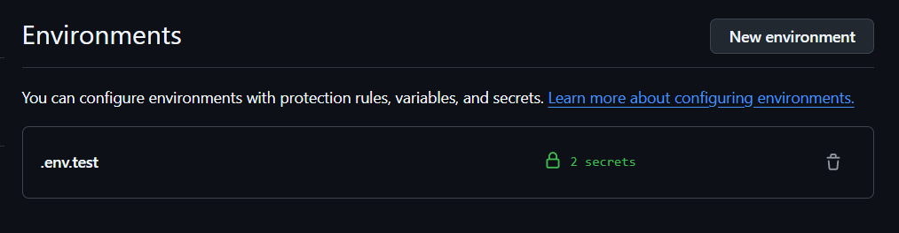
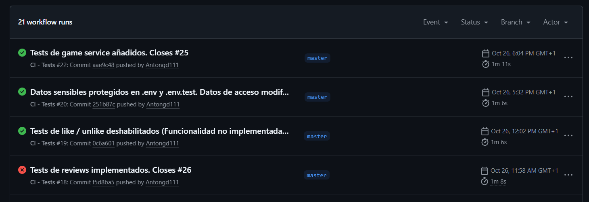
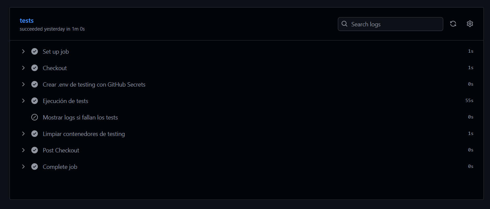
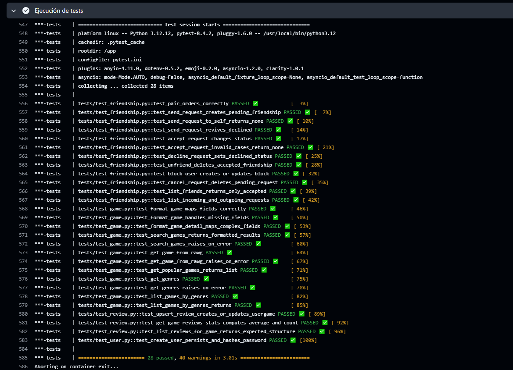

# Hito 2: Integración continua

El objetivo de este hito es la integración continua del proyecto. Las herramientas utilizadas para cada función son las siguientes:

## Gestor de tareas
Como gestor de tareas para la ejecución de los tests, he utilizado el propio **Docker Compose**, que levanta el entorno de tests y ejecuta el comando de ejecución de los tests.

Aunque no sé si puede considerarse un gestor de tareas en el sentido estricto de la palabra, tales como lo son **npm** o **make**, me ha parecido lo más apropiado por las siguientes razones:

- Mi backend ya se despliega en un contenedor desde un principio utilizando docker compose, por lo que en este punto conozco la herramienta y cómo integrarla en mi proyecto.

- Mantener la coherencia con el entorno de desarrollo. Al desplegarse la aplicación en un contenedor, utilizando la misma herramienta he sido capaz de replicar el entorno de desarrollo correctamente para los tests.

- Consigo crear una BD temporal para los tests de manera similar a como lo hago para desplegar la de desarrollo. De esta forma, los tests no influirán en el entorno real al hacer operaciones en esta base de datos efímera. En cada ejecución del contenedor de la BD de tests se crean y destruyen las tablas, por lo que no dependen de migraciones y cambios en BD.

En resumen, como mi aplicación ya se ejecutaba en contenedores y tenía la lógica creada con docker compose, he considerado conveniente ejecutar los tests directamente con contenedores. Espero que esto no sea un problema para la evaluación de este punto, ya que en el hito 4 haremos despliegue con contenedores.

Adjunto el docker-compose-test.yml que utilizo para levantar los servicios de tests.

```yaml
services:
  db_test:
    image: postgres:15
    container_name: playtracker-db-test
    env_file: .env.test
    restart: unless-stopped
    environment:
      POSTGRES_USER: ${POSTGRES_USER}
      POSTGRES_PASSWORD: ${POSTGRES_PASSWORD}
      POSTGRES_DB: ${POSTGRES_DB}
    ports:
      - "5433:5432"
    tmpfs: /var/lib/postgresql/data # Utilizo un sistema de archivos temporal para los tests

  tests:
    build: .
    container_name: playtracker-tests
    env_file: .env.test
    depends_on:
      - db_test
    volumes:
      - ./:/app
    command: >
      sh -c "pytest --maxfail=1 --disable-warnings -v"
      
```

## Biblioteca de aserciones y marco de pruebas

Como biblioteca de aserciones y marco de pruebas para la construcción de los tests, he utilizado el framework *pytest*. La forma de construir aserciones con este framework es muy simple y entendible a primera vista. 

Como ejemplo, veamos el test que comprueba la salida correcta de la función *get_game_reviews_stats*, que devuelve la media de puntuación de los usuarios de un juego y el total de valoraciones:

```python
async def test_get_game_reviews_stats(db_session: AsyncSession):
    u1 = await _create_user(db_session, "p1")
    u2 = await _create_user(db_session, "p2")
    g = await _create_game(db_session, 222, "The Witcher 3")

    await _create_usergame(db_session, u1, g, score=8)
    await _create_usergame(db_session, u2, g, score=6)

    avg, cnt = await service.get_game_reviews_stats(db_session, g.rawg_id)
    assert round(avg, 1) == 7.0
    assert cnt == 2
```

Las funciones _create_user, _create_game y _create_usergame son helpers definidos específicamente para los tests, para generar información de prueba.

Las aserciones, como podemos comprobar, se basan simplemente en comparar dos valores con el operador "==", mientras que en otras bibliotecas (como *unittest* o *nose*) se utilizan funciones que, si bien son simples, dificultan la legibilidad de las aserciones.

Existen también otras bibliotecas de aserciones, como *doctest*, en las que los tests se definen en la misma función a forma de documentación. Sin embargo, bibliotecas como esta no soportan funciones asíncronas como las que utilizo en la mayoría de mi lógica de negocio. Estas bibliotecas están enfocadas a ejemplos en la documentación más que a tests reales.

Como ya he descrito, *pytest* también se encarga de la ejecución de los tests. Por lo que he investigado, las otras bibliotecas ya mencionadas anteriormente para las aserciones también ejecutan sus propios tests, por lo que la elección del _test runner_ queda ligada a la elección de la biblioteca de aserciones, y viceversa.

### Configuración de los tests

La configuración de los tests en pytest se hace a través del archivo [conftest.py](../../backend/tests/conftest.py). En este archivo se definen **fixtures**, funciones que se utilizan para preparar el estado necesario para la ejecución de cada test y la limpieza posterior al test. 

En mi caso, por ejemplo, tengo este fixture para levantar la BD temporal para los tests a partir de los modelos (Base). Primero elimina las tablas generadas por la misma fixture en el test anterior, y después las regenera para tenerlas listas desde 0 en el nuevo test:

```python
@pytest.fixture(scope="function", autouse=True)
async def prepare_database():
    async with engine.begin() as conn:
        await conn.run_sync(Base.metadata.drop_all)
        await conn.run_sync(Base.metadata.create_all)
    yield
```

Hay algunos fixtures más complejos para los que he tenido que indagar más, como el de la creación del cliente HTTP asíncrono para mis funciones asíncronas. Sin embargo, como ejemplo de fixture, el anterior queda más claro.

### Ejecución de los tests
Para ejecutar los tests, se utiliza el comando:

```bash
sh -c "pytest --maxfail=1 --disable-warnings -v"
```

Al ejecutarlo, pytest detecta automáticamente los archivos que tienen formato "test_*.py" y ejecuta todos los tests definidos en dichos archivos. --maxfail=1 hace que detenga la ejecución cuando un test falle.

Sin embargo, para el funcionamiento de los tests es necesario el despliegue de la base de datos de pruebas, que se ejecuta en un contenedor. Aquí es donde entra el **docker-compose-test.yml** descrito al principio del hito, que levanta un contenedor con la BD de pruebas y otro que ejecutará los tests. Este segundo, como podemos apreciar al final del archivo, es el que ejecuta el comando que he mencionado para ejecutar pytest.

La salida que genera esta ejecución la veremos directamente en el siguiente apartado, que ejecutará estos tests al pushear al repositorio de Github gracias a **Github Actions**.

## Integración Continua con GitHub Actions

Por último, veamos la utilidad de esta infraestructura utilizando un sistema de integración continua. En mi caso, he elegido GitHub Actions frente a otros por las siguientes razones:

- Está integrado en el propio repositorio que utilizo sin necesidad de configurar servicios externos como Jenkins. Como no tengo experiencia ni preferencia por ningún otro servicio, esta ha sido mi primera opción.

- Configuración de variables de entorno en el propio repositorio gracias a **GitHub Secrets**.

Antes de continuar explicando la configuración de la IC en mi trabajo, quiero detenerme en explicar el uso que le he dado a GitHub Secrets.

El principal problema al que me he enfrentado a la hora de ejecutar la infraestructura de tests en el sistema de integración continua ha sido el manejo de datos sensibles. No es correcto subir contraseñas y claves de API al repositorio, por lo que las manejo en un .env que no se sube.

Sin embargo, GitHub Secrets permite la creación de variables de entorno secretas en el propio repositorio, de una manera muy sencilla. Simplemente en la configuración del repositorio - environments se pueden crear estas variables de manera segura (incluso pide doble factor de autenticación).



Por estas razones he elegido GitHub Actions para la integración continua. Por último, voy a explicar el flujo que sigue para ejecutar los tests y a mostrar los resultados de los mismos en Actions.

### Configuración del workflow de IC
Para configurar el flujo de trabajo que sigue Actions, se define un fihero yml en la carpeta _.github/workflows_, en la raíz del proyecto. El contenido del fichero en mi caso es el siguiente:

```yml
name: CI - Tests

on:
  push:
    branches: [ master ]
  pull_request:
    branches: [ master ]

jobs:
  tests:
    runs-on: ubuntu-latest
    environment: ".env.test"

    steps:
      - name: Checkout
        uses: actions/checkout@v4

      - name: Crear .env de testing con GitHub Secrets
        env:
          DB_USER: ${{ secrets.PT_DB_USER }}
          DB_PASS: ${{ secrets.PT_DB_PASS }}
        run: |
          cat > backend/.env.test << EOF
          APP_ENV=testing
          POSTGRES_USER=${DB_USER}
          POSTGRES_PASSWORD=${DB_PASS}
          POSTGRES_DB=playtracker_test
          DATABASE_URL=postgresql+asyncpg://${DB_USER}:${DB_PASS}@db_test:5432/playtracker_test

          SECRET_KEY=dummy-secret-for-ci
          ACCESS_TOKEN_EXPIRE_MINUTES=60
          ALGORITHM=HS256
          RAWG_API_KEY=dummy-rawg-key
          EOF

      - name: Levantar contenedores de testing y ejecutar tests
        run: |
          docker compose \
            -p playtracker-ci \
            -f backend/docker-compose.test.yml \
            --env-file backend/.env.test \
            up --build --abort-on-container-exit --exit-code-from tests

      - name: Mostrar logs si fallan los tests
        if: failure()
        run: |
          docker compose -p playtracker-ci -f backend/docker-compose.test.yml logs --no-color || true

      - name: Limpiar contenedores de testing
        if: always()
        run: |
          docker compose -p playtracker-ci -f backend/docker-compose.test.yml down -v --remove-orphans
```

Aunque pueda parecer complejo, consta de una serie de _jobs_ que se definen por un nombre (-name) y un comando a ejecutar (-run). Adicionalmente pueden aparecer otras etiquetas, como el condicional **if** que ejecuta ese bloque si se cumple una condición, o **env** que define variables de entorno necesarias para una ejecución que se recogen de los Secrets Environments explicados con anterioridad.

Los trabajos que he definido en Actions son los siguientes:
1. Checkout (crea un repo temporal para ejecutar el workflow)
2. Crear .env.test con las variables de secrets (y otras no sensibles definidas directamente en el mismo archivo).
3. Levantar los contedores ejecutando el docker compose de testing.
4. Mostrar logs si fallan los tests (if failure()).
5. Limpiar contenedores al terminar.

Esto se ejecuta cada vez que se hace un push al repositorio. Adjunto los resultados de varias subidas que he hecho durante el desarrollo de este hito:



Este es el flujo visto en Actions:



Y en concreto, esta es la salida de pytest dentro del flujo de Actions:



Aunque parecen muchos tests, hay muchos que ejecutan la misma función pero esperando distintos resultados (salida exitosa y manejo de varios errores). He podido dedicar bastante tiempo a la definición de los tests al tener la mayoría de las funciones ya implementadas desde el principio, aunque haya tenido que refactorizar algunas.

Los tests al completo se pueden ver en los distintos archivos situados en la carpeta [test](../../backend/tests/) del backend.