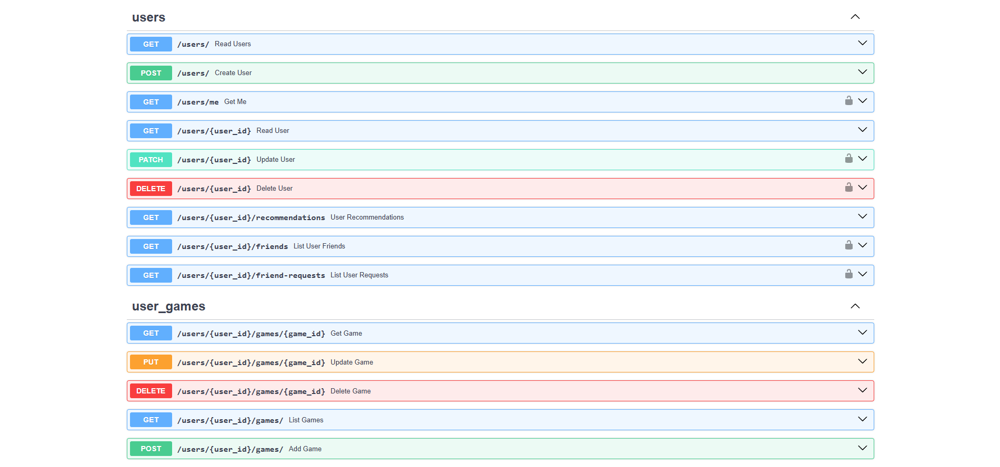
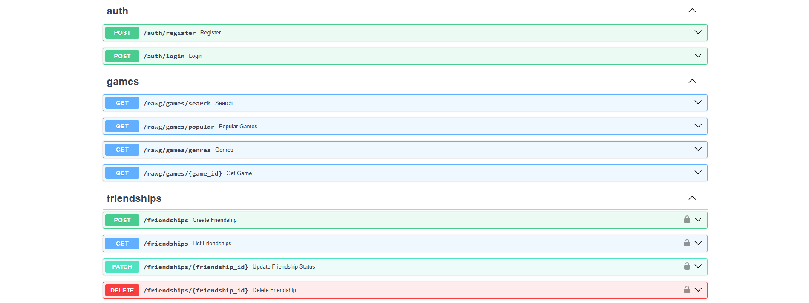
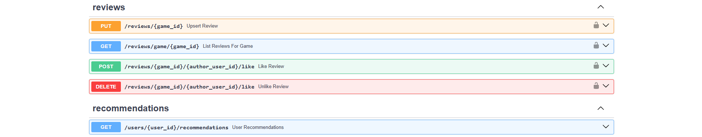
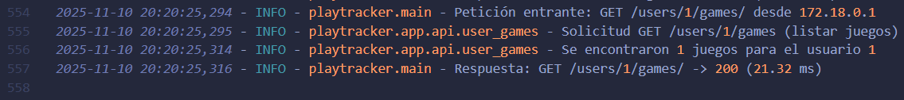
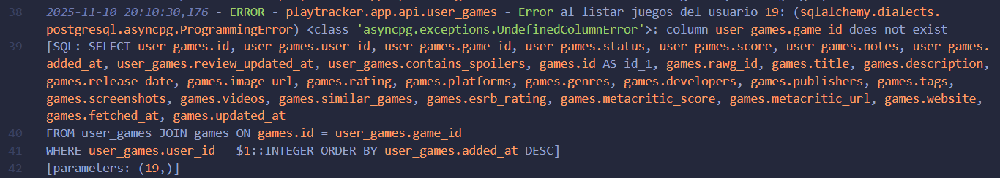

# Hito 3: Diseño de microservicios

El objetivo de este hito es el diseño de la aplicación en forma de microservicio. Para ello, es necesaria la implementación de una API REST para el acceso externo a la funcionalidad de la aplicación. También se implementa un sistema de logs para monitorizar el acceso a la API.

## Consideraciones iniciales
Antes de comenzar este Hito, mi aplicación ya contaba con una API con un número de endpoints considerable. En el hito anterior, ya se completó la separación de responsabilidades moviendo la funcionalidad en su totalidad a los servicios, por lo que la API simplemente recibe los datos y llama a las funciones implementadas en los servicios. El trabajo que he desempeñado en este hito, por tanto, ha sido:
- Refactorización de algunos endpoints para hacer una separación de grupos más correcta.
- Implementación del logger para registrar la actividad de la API en ficheros de log en el directorio del proyeto.

> **Nota importante:** en este hito es donde menos he desarrollado mi aplicación por falta de tiempo, por lo que alfunas de las funcionalidades más interesantes (como las recomendaciones) que suponen mayor lógica de negocio no están implementadas aún.

## Diseño de la API (FastAPI)
Como mi aplicación ya estaba en desarrollo antes de empezar la asignatura, tenía una API funcional para comunicarse con el frontend. Sin embargo, al comienzo de la asignatura no tenía una separación estricta entre funcionalidad (services) e interfaz (API). A lo largo de la asignatura, he estado refactorizando la API, separando los endpoints en grupos, cambiando rutas, eliminando endpoints redundantes... La API en este punto tiene los siguientes endpoints:





He intentado separar los endpoints de la forma más coherente posible, he hecho los siguientes grupos:
- **users** para los casos de uso sobre la información de los usuarios correspondiente únicamente a la tabla *user* del modelo.
- **user_games** para las relaciones de los usuarios con los videojuegos, correspondiente a la tabla *user_game* del modelo.
- **auth** para las rutas correspondientes a login y registro de usuarios.
- **games** para las rutas correspondientes a la obtención de información de videojuegos (*Nótese la diferencia con user_games, que no obtiene información de los juegos, solo de las relaciones de los usuarios con los mismos*). Correspondiente a la tabla *game* del modelo.
- **friendship** para las relaciones y solicitudes entre usuarios, correspondiente a la tabla *friendship*.

Los siguientes grupos NO se corresponden con tablas del modelo de la aplicación, sino que ejecutan funcionalidades adicionales (recommendations) o reúnen información de varias tablas (reviews).

- **reviews** para las reseñas de los usuarios de los juegos.
- **recommendations** con un único endpoint para obtener recomendaciones personalizadas para un usuario.

> **Nota:** lo más probable es que estos grupos cambien a lo largo del desarrollo, ya que aún tengo que refactorizar algunas funcionalidades y añadir otras.

## Implementación del logging
### Configuración
Para hacer el logging de los accesos a la aplicación, he utilizado el módulo **logging** de Python, ya que es más que suficiente para hacer logs de cualquier tipo, es fácil de integrar y no requiere dependencias externas, y permite rotación de archivos de logs para renovar los ficheros de logs por tiempo o tamaño de archivo, permitiendo que no se genere un solo archivo que puede escalar en tamaño de manera infinita.

La configuración del logger es muy sencila, y se encuentra en el archivo [logger_config.py](../../backend/app/core/logger_config.py). La configuración consta de una sola función que recibe como parámetro el nombre del logger (que se mostrará en los logs). Se configura un directorio, que en mi caso es */logs*, y un nombre de archivo, como es el logging de la API, el archivo lo he llamado api.log.

La función *get_logger* devuelve el logger correspondiente al nombre pasado como argumento si ya existe, y si no, crea uno añadiendo el mínimo nivel de log que debe reportar (INFO en mi caso), el formato de los mensajes de log, y la rotación de archivos, que la tengo definida para que cambie de archivo cada 5MB, manteniendo siempre los 3 últimos archivos de logs además del actual (viene definido por el parámetro *backupCount*).

```python
import logging
from logging.handlers import RotatingFileHandler
from pathlib import Path

# Configuración del directorio y archivos de logs
LOG_DIR = Path("logs")
LOG_DIR.mkdir(exist_ok=True)

LOG_FILE = LOG_DIR / "api.log"


def get_logger(name: str | None = None) -> logging.Logger:

    logger_name = "playtracker"
    if name:
        logger_name = f"playtracker.{name}"

    logger = logging.getLogger(logger_name)

    if logger.handlers:
        # Ya está configurado, no añadimos handlers otra vez
        return logger

    logger.setLevel(logging.INFO)

    # Formato de los mensajes de logs
    formatter = logging.Formatter(
        "%(asctime)s - %(levelname)s - %(name)s - %(message)s"
    )

    # Configuramos rotación para no saturar un solo archivo de logs (Máximo de 5MB por archivo, 3 backups)
    file_handler = RotatingFileHandler(
        LOG_FILE,
        maxBytes=5 * 1024 * 1024,
        backupCount=3,
        encoding="utf-8",
    )

    file_handler.setFormatter(formatter)

    stream_handler = logging.StreamHandler()
    stream_handler.setFormatter(formatter)

    logger.addHandler(file_handler)
    logger.addHandler(stream_handler)

    return logger
```

### Uso del logger en la aplicación
Como el objetivo del logger es monitorizar los accesos a la API, lo he utilizado en los propios endpoints. He estado valorando si es correcto utilizar el logger ahí o sería mejor utilizarlo en los services, donde se implementa la funcionalidad de la aplicación, pero he decidido hacerlo en la API en este caso porque, de momento, el objetivo es únicamente registrar los accesos a la API y los errores generados de dichos accesos, no hacer un debug de la funcionalidad de la aplicación. A lo largo del desarrollo restante, sin embargo, no descarto implementar logging a nivel de funcionalidad de la lógica de negocio.

Un ejemplo del uso del logger en mi API es el siguiente, correspondiente a la obtención de los videojuegos de un usuario a partir de una query:
```python
@router.get("/", response_model=List[UserGameOut])
async def list_games(user_id: int, db: AsyncSession = Depends(get_db)):
    logger.info(f"Solicitud GET /users/{user_id}/games (listar juegos)")
    try:
        games = await service.get_user_games(db, user_id)
        logger.info(f"Se encontraron {len(games)} juegos para el usuario {user_id}")
        return games
    except Exception as e:
        logger.exception(f"Error al listar juegos del usuario {user_id}: {e}")
        raise HTTPException(status_code=500, detail="Error interno al listar juegos")
```

Como he dicho anteriormente, el objetivo de momento no es hacer log de los errores concretos derivados de la funcionalidad de la aplicación, por lo que he definido logs para:
- Informar de que se ha obtenido la solicitud (INFO)
- Informar de que se ha realizado la acción correctamente (INFO)
- Informar de que se ha producido un error (EXCEPTION)

De esta forma, queda registrado tanto el acceso al endpoint como su resultado.

### Ejemplo de uso

Para el endpoint anterior, voy a hacer dos peticiones, una con caso de éxito y otra forzando un error, para que veamos los dos resultados posibles registrados en el log.

*Caso de éxito*

*Caso de error*


En caso de error, se muestra el mensaje definido en el logger seguido del error completo.

Todas los demás endpoints hacen logs de la misma forma, informando al entrar la petición y el resultado de la misma.

## Tests de la API