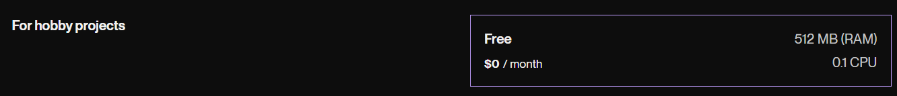
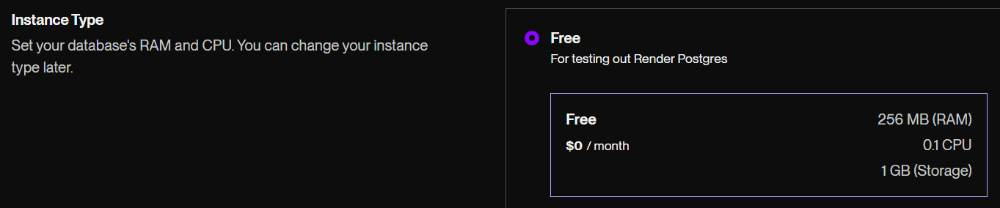
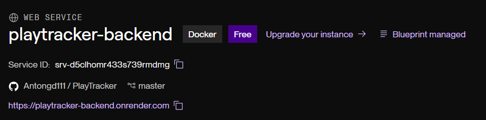
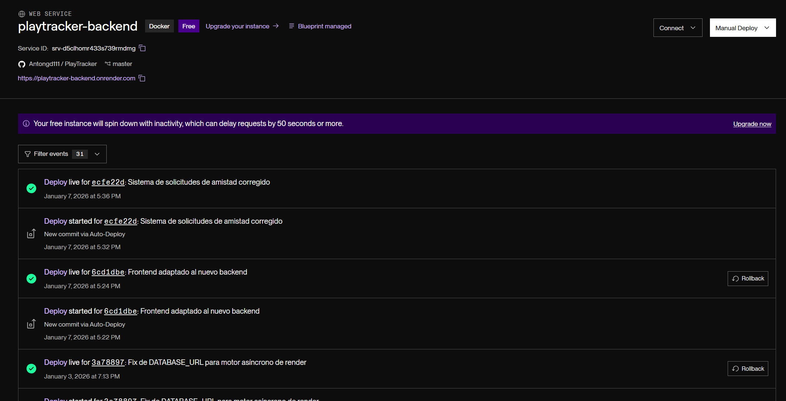
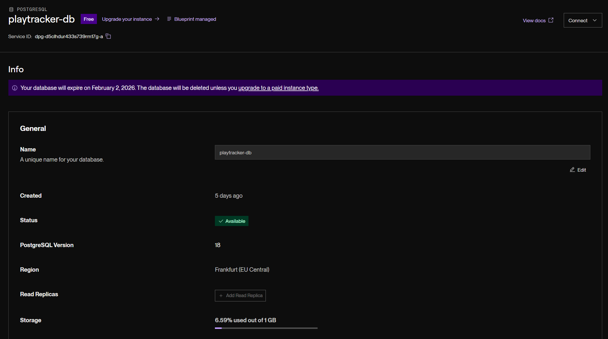
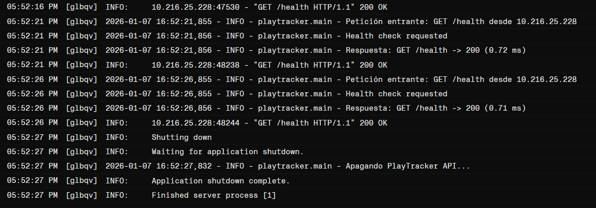
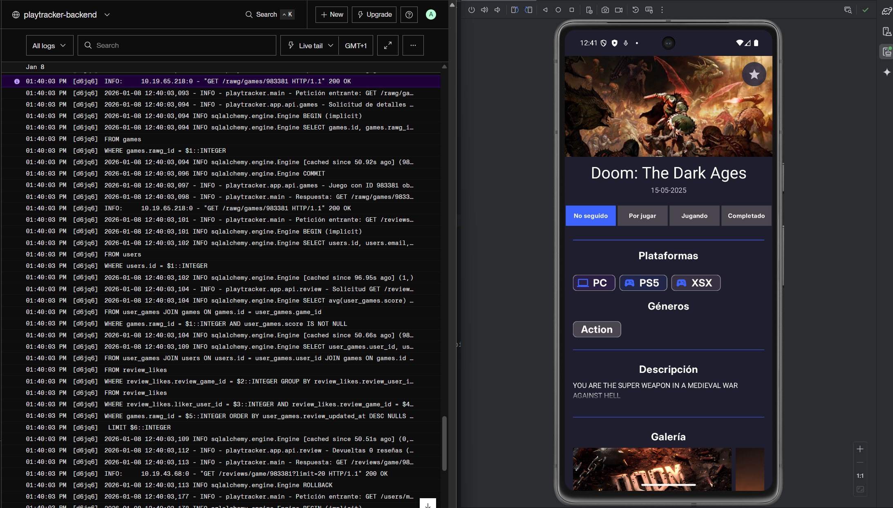
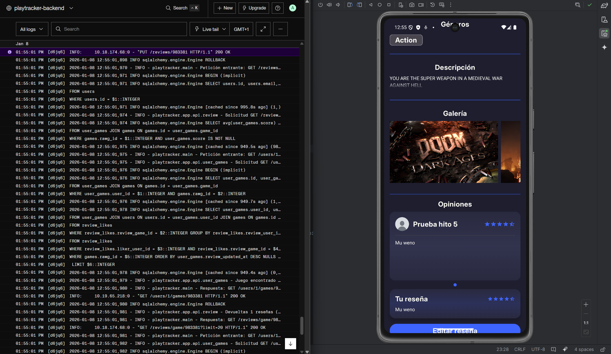
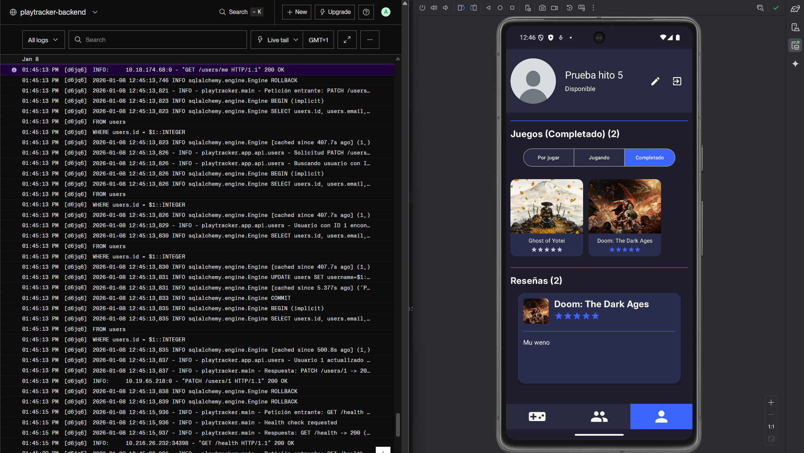
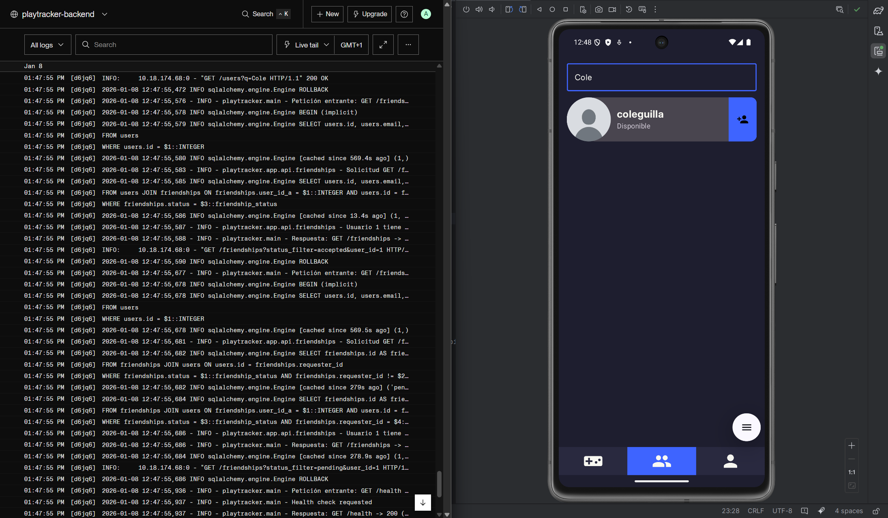

# Hito 5: Despliegue de la aplicación en Render
Para este hito, he decidido utilizar la PaaS **[Render](https://render.com/)** para el despliegue en la nube frente a otras soluciones IaaS/PaaS. Mi decisión ha sido esta tras valorar:

- **Simplicidad en la configuración:** para el tipo de aplicación y la relativa simplicidad de su despliegue y configuración, he optado por elegir un PaaS que gestione de base toda la infraestructura. Podría haberlo montado perfectamente en cualquier IaaS, pero serían configuraciones innecesarias adicionales de las que he podido prescindir en un PaaS como Render.<br></br>

- **Poca necesidad de gestión:** la plataforma ya hace automáticamente rollbacks y health checks continuos para comprobar la disponibilidad del servicio y notificar en caso de error (esto se explicará más adelante).<br></br>

- **Coste predecible:** al contrario que otras plataformas (tanto PaaS como IaaS), no necesita de datos de facturación para su capa gratuita. 
    - En **Google Cloud**, por ejemplo, aunque hay una capa gratuita de hasta $300 en créditos, se piden los datos de facturación antes de poder empezar a utilizar la plataforma, y una vez acabado el saldo gratuito se empieza a cobrar automáticamente (no sin antes notificar al usuario).
    - Por otra parte, con **Render**, disponemos de una capa gratuita total, que aunque muy limitada, proporciona un entorno seguro frente a pagos indeseados y más que suficiente para mi desarrollo.
    
    <br></br>

- **Posibilidad de elegir la región de despliegue.**


## Herramientas y despliegue de la aplicación
Para la automatización del despliegue, en Render se utilizan los **Blueprints**, definidos mediante un fichero `render.yaml`, donde se definen de forma declarativa los servicios a desplegar, y sus variables de entorno y dependencias necesarias.

Con los blueprints de Render, se puede **definir la infraestructura mediante ficheros**, sin depender de la web. Es por esto que he elegido esta herramienta de despliegue para la práctica. 

El fichero `render.yaml` es el siguiente:

```yaml
services:
   -
      type: web
      name: playtracker-backend
      runtime: docker
      region: frankfurt
      plan: free

      dockerfilePath: backend/Dockerfile
      dockerContext: backend

      dockerCommand: uvicorn main:app --host 0.0.0.0 --port ${PORT}

      healthCheckPath: /health

      envVars:
         -
            key: DATABASE_URL
            fromDatabase:
               name: playtracker-db
               property: connectionString
         -
            key: SECRET_KEY
            sync: false
         -
            key: RAWG_API_KEY
            sync: false
         -
           key: ACCESS_TOKEN_EXPIRE_MINUTES
           value: "60"
         -
           key: ALGORITHM
           value: HS256

databases:
   -
      name: playtracker-db
      region: frankfurt
      plan: free

```

Se definen un servicio para el backend y una base de datos. Voy a desglosar el fichero a continuación.

#### Backend
- **Definición del entorno, el plan y la región donde se desplegará la aplicación.** He elegido Frankfurt, ya que de las [ofertadas por Render](https://render.com/docs/regions), es la única que está en un país de la Unión Europea, cumpliendo las regulaciones legales.
    ```yaml
        type: web
        name: playtracker-backend
        runtime: docker
        region: frankfurt
        plan: free
    ```
    
- **Definición de la ruta a la imagen de Docker**.
    ```yaml
        dockerfilePath: backend/Dockerfile
        dockerContext: backend
    ```

- **Definición del comando de arranque del contenedor,** que es el que se utiliza para ejecutar el backend.
    ```yaml
        dockerCommand: uvicorn main:app --host 0.0.0.0 --port ${PORT}
    ```

- **Definición de la ruta del healthcheck**. Para el despliegue, he creado un endpoint GET /health que devuelve 200 (OK). Render hará llamadas periódicas a este endpoint para confirmar si el servicio está en funcionamiento.
    ```yaml
        healthCheckPath: /health
    ```

- **Declaración de variables de entorno**: Se definen las variables de entorno necesaias para el despliegue. Hay 2 que se introducirán al conectar el repositorio desde Render por seguridad, `SECRET_KEY` y `RAWG_API_KEY`. Las demás las pongo como valores fijos.
    ```yaml
        envVars:
            -
                key: DATABASE_URL
                fromDatabase:
                name: playtracker-db
                property: connectionString
            -
                key: SECRET_KEY
                sync: false
            -
                key: RAWG_API_KEY
                sync: false
            -
            key: ACCESS_TOKEN_EXPIRE_MINUTES
            value: "60"
            -
            key: ALGORITHM
            value: HS256
    ```

#### Base de datos
Para la definición de la base de datos, simplemente hay que indicar el nombre, la región y el plan elegido. Render ofrece solo bases de datos PostgreSQL, que es la que he utilziado durante todo el desarrollo, por lo que no he necesitado gestiones adicionales en esta parte.
```yaml
databases:
   -
      name: playtracker-db
      region: frankfurt
      plan: free
```

## Automatización del despliegue
Lo que buscamos en este hito es que cada push hecho a GitHub redespliegue la aplicación de manera automática. Para ello, simplemente se configura desde la web de Render, vinculando el repositorio deseado. Se puede observar el repositorio vinculado en el servicio que levanta:



El proceso es sencillo, seleccionamos crear Blueprint en Render, seleccionamos el repositorio del proyecto, y quedará vinculado al Blueprint, para que cada vez que se haga un nuevo commit al repositorio, se redesplieguen los servicios con los nuevos cambios.

Cuando se vincula el repositorio a Render, este revisará el fichero `render.yaml` automáticamente, informará de errores de sintaxis antes de intentar ejecutar el entorno, y una vez aceptemos, comenzará a desplegar los servicios definidos en el fichero.

> Nota: Si hubiera variables de entorno definidas con `sync: false` en `render.yaml`, se pedirá que se introduzcan sus valores en este momento. En mi caso tengo que introducir la clave de la API del proveedor de datos RAWG y la clave secreta para JWT.

#### Servicios desplegados





Una vez desplegados los servicios, podemos mirar los logs de cada despliegue, el estado del servicio, así como hacer rollbacks a despliegues anteriores con un solo click. Podemos ver los logs con los healtchecks automáticos de Render en la siguiente imagen:



Podemos observar también que el servicio se detiene tras un tiempo sin actividad. Esto es debido a la capa gratuita de Render, que detiene los servicios inactivos para ahorrar recursos.

## Monitorización y observabilidad

## Funcionamiento y pruebas de la aplicación tras el despliegue

Para mostrar correctamente y de manera visual el correcto funcionamiento de la aplicación, he adaptado el frontend que tenía implementado antes de comenzar a adaptar la aplicación para la asignatura.

He tenido que cambiar casi por completo la capa de servicio del frontend, ya que durante el desarrollo de los hitos, el backend ha cambiado por completo. Si se quieren probar las funcionalidades de manera independiente al frontend, se puede utilizar la API expuesta en:
```http
https://playtracker-backend.onrender.com/docs
```

Repasemos las funcionalidades principales y su correcto funcionamiento con un emulador y los logs de render. Mostraré los logs de Render **a partir de la primera petición de la funcionalidad mostrada**, maracada en **morado**.


#### Obtener detalles de un juego


#### Modificación de una review


#### Perfil de usuario


#### Búsqueda de usuarios

